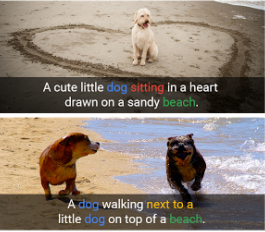
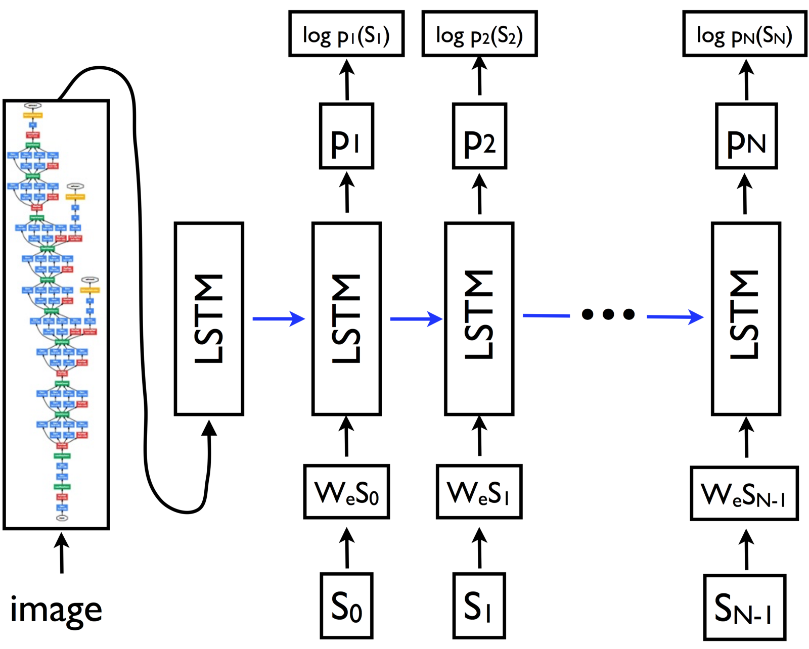
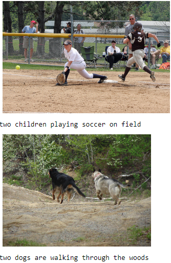
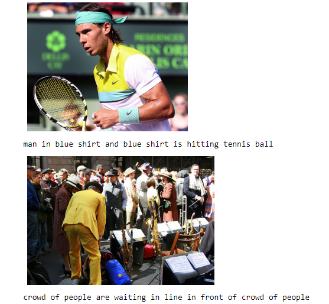
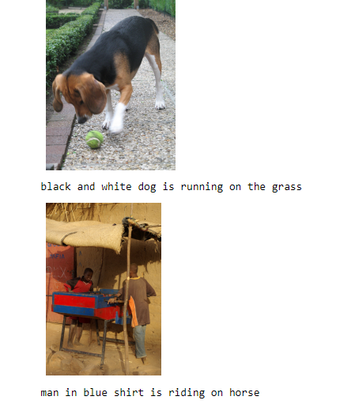
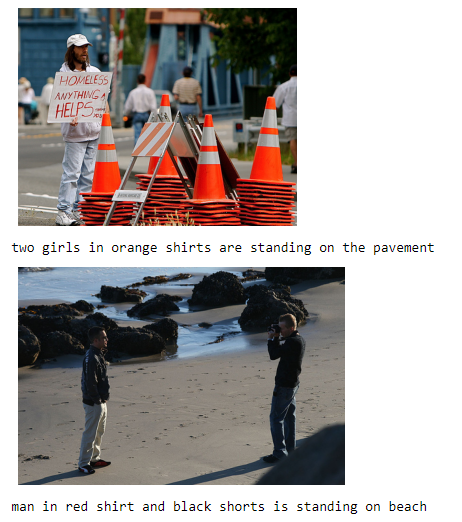

# IMAGE - CAPTIONING

`Image Captioning` can be defined in simple words as ``"Automatically generating the textual description using an artificial intelligence based system for an image"``. The goal of such a system is to convert a given input image into the textual Description or rather Natural Language based Description.  

  

The above example is enough to understand image captioning.  

Generation of captions is a challenging artificial intelligence problem where a textual description must be generated for a given photograph.  
It requires methods both from computer vision to understand the content of an image and a language model from the field of natural language processing to turn the understanding of the image into words in the right order.  
This is also a very active area of research and an interesting multi modal topic where combination of both image and text processing is used to build a useful Deep Learning application, aka Image Captioning.    

---
### Dataset
The dataset used is flickr8k. You can request the data [here](https://www.kaggle.com/shadabhussain/flickr8k). Extract the images in Flickr8K_Data and the text data in Flickr8K_Text.

---
### Requirements
- Tensorflow
- Keras
- Numpy
- h5py
- Pandas
- NLTK
- OpenCv

---
### Applications of Image captioning
  - Probably can be used in the applications where text is used mostly and with the use of this we can infer a image in form of text.
  - NLP is used extensively in the market now-a-days. For example, summarizing or gaining insights from a large corpus of text. In the same way, we can use the same concept to get insights from images as well.
  - We can build a 360-degree metastore and make use of it in a wide variety of business like making user searches more efficient on an e-commerce platform based on metadata of products, other may be some other things like recommendations and all. One such application is here: https://www.sophist.io/
  - We can describe like what happen in a given video segment.
  - Can be used to give something back to mankind for visually impaired people.
 and many more.

---
The task of image captioning can be divided into two modules logically – one is an `image-based model` – which extracts the features and nuances out of our image, and the other is a `language-based model` – which translates the features and objects given by our image-based model to a natural sentence.    
For our image-based model (viz encoder) – we usually rely on a `Convolutional Neural Network` model. And for our language-based model (viz decoder) – we rely on a `Recurrent Neural Network`. The image below summarizes the approach given above.

  

---

### Output
The output of the model is a caption to the image generated text 

---
### Results

  

  

  

  

---

